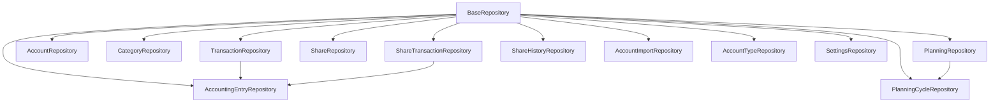

# Repository Pattern

Documentation of FiniA's repository layer that abstracts database operations.

---

## Overview

FiniA implements the **Repository Pattern** to decouple domain logic from database access. This provides:

- ✅ **Centralized data access** - All SQL queries in one place
- ✅ **Testability** - Easy to mock repositories for unit tests
- ✅ **Maintainability** - Changes to database schema require updates in one layer
- ✅ **Transaction support** - Integration with Unit of Work pattern

---

## Architecture

### Base Repository

All repositories extend `BaseRepository`:

**File:** [src/repositories/base.py](../../src/repositories/base.py)

```python
class BaseRepository:
    def __init__(self, uow_or_cursor):
        """Initialize repository with either UnitOfWork or raw DB cursor."""
        if hasattr(uow_or_cursor, "cursor"):
            # UnitOfWork or connection wrapper
            self.uow = uow_or_cursor
            self.cursor = uow_or_cursor.cursor
        else:
            # Raw cursor passed directly
            self.uow = None
            self.cursor = uow_or_cursor
```

**Flexibility:**
- Accepts **UnitOfWork** (for transaction management)
- Accepts **raw cursor** (for simple queries)

---

### Unit of Work Pattern

**File:** [src/infrastructure/unit_of_work.py](../../src/infrastructure/unit_of_work.py)

```python
class UnitOfWork(AbstractContextManager):
    def __init__(self, connection):
        self.connection = connection
        self._cursor = None

    def __enter__(self):
        self._cursor = self.connection.cursor()
        return self

    @property
    def cursor(self):
        return self._cursor

    def commit(self):
        self.connection.commit()

    def rollback(self):
        self.connection.rollback()

    def __exit__(self, exc_type, exc, tb):
        try:
            if exc:
                self.rollback()
            else:
                self.commit()
        finally:
            if self._cursor:
                self._cursor.close()
```

**Usage:**

```python
with UnitOfWork(connection) as uow:
    transaction_repo = TransactionRepository(uow)
    entry_repo = AccountingEntryRepository(uow)
    
    # Both operations in same transaction
    tx_id = transaction_repo.insert(...)
    entry_repo.insert(tx_id, ...)
    
    # Auto-commit on success, rollback on exception
```

---

## Repository Catalog

FiniA has **13 repositories** organized by domain:

### Core Financial Entities

#### 1. TransactionRepository

**File:** [src/repositories/transaction_repository.py](../../src/repositories/transaction_repository.py)

**Purpose:** Manage transactions (tbl_transaction)

**Key Methods:**

```python
# Insert transaction
tx_id = transaction_repo.insert_ignore(
    account_id=1,
    description="REWE Markt",
    amount=Decimal("-45.50"),
    date_value=datetime(2025, 1, 15),
    iban="DE12345...",
    bic="ABCDEFGH",
    recipient_applicant="REWE Markt GmbH"
)

# Get paginated transactions with search/filter
result = transaction_repo.get_all_transactions_paginated(
    page=1,
    page_size=50,
    search="REWE",  # Search in description/recipient/account/category
    filter_type="unchecked"  # Filter options: unchecked, no_entries, uncategorized, categorized_unchecked
)
# Returns: {'transactions': [...], 'page': 1, 'page_size': 50, 'total': 150}

# Get transactions by account
transactions = transaction_repo.get_transactions_by_account(
    account_id=1,
    page=1,
    page_size=100,
    search="Grocery",
    filter_type="uncategorized"
)

# Update transaction fields
transaction_repo.update_transaction(
    transaction_id=123,
    description="Updated description",
    amount=Decimal("-50.00"),
    date_value=datetime(2025, 1, 20),
    iban="DE98765...",
    recipient_applicant="New recipient"
)

# Delete transaction (cascade deletes accounting entries)
transaction_repo.delete_transaction(transaction_id=123)

# Mark transactions as checked
transaction_repo.mark_transactions_checked(transaction_ids=[1, 2, 3])

# Get transaction by ID
transaction = transaction_repo.get_transaction_by_id(transaction_id=123)
```

**Features:**
- Pagination support (max 100,000 per page)
- Full-text search across multiple fields
- Filter by status (unchecked, uncategorized, etc.)
- Category name caching (hierarchical names)
- Accounting entry relationships

---

#### 2. AccountingEntryRepository

**File:** [src/repositories/accounting_entry_repository.py](../../src/repositories/accounting_entry_repository.py)

**Purpose:** Manage split transactions (tbl_accountingEntry)

**Key Methods:**

```python
# Insert accounting entry
entry_id = entry_repo.insert(
    transaction_id=123,
    category_id=5,
    amount=Decimal("-45.50"),
    checked=False
)

# Get entries for transaction
entries = entry_repo.get_entries_by_transaction(transaction_id=123)
# Returns: [{'id': 1, 'category_id': 5, 'amount': -45.50, 'checked': False}, ...]

# Update entries (replace all entries for transaction)
entry_repo.update_entries_for_transaction(
    transaction_id=123,
    entries=[
        {'id': 1, 'category_id': 5, 'amount': Decimal("-30.00")},
        {'category_id': 8, 'amount': Decimal("-15.50")}  # New entry (no id)
    ]
)

# Delete entry
entry_repo.delete_entry(entry_id=1)

# Get unchecked entries view
unchecked = entry_repo.get_unchecked_entries()
# Uses view_accountingEntriesNotChecked
```

**Split Transaction Example:**

```python
# Original transaction: REWE Markt | -75.00
with UnitOfWork(connection) as uow:
    entry_repo = AccountingEntryRepository(uow)
    
    # Split into two categories
    entry_repo.update_entries_for_transaction(
        transaction_id=123,
        entries=[
            {'category_id': 2, 'amount': Decimal("-50.00")},  # Groceries
            {'category_id': 8, 'amount': Decimal("-25.00")}   # Household Items
        ]
    )
    # Total must equal transaction amount (-75.00)
```

---

#### 3. AccountRepository

**File:** [src/repositories/account_repository.py](../../src/repositories/account_repository.py)

**Purpose:** Manage accounts (tbl_account)

**Key Methods:**

```python
# Get account type ID by name
type_id = account_repo.get_type_id("Girokonto")

# Get account ID by name
account_id = account_repo.get_id_by_name("Personal Checking")

# Insert account (domain model)
from domain.account import Account
account = Account(
    name="Personal Checking",
    iban_accountNumber="DE123...",
    bic_market="ABCDEFGH",
    startAmount=Decimal("1000.00"),
    dateStart=datetime(2025, 1, 1),
    dateEnd=None,
    type_name="Girokonto"
)
account_repo.insert(account)

# Update clearing account
account_repo.update_clearing_account(
    name="Securities Depot",
    clearing_name="Clearing Account"
)
```

---

#### 4. CategoryRepository

**File:** [src/repositories/category_repository.py](../../src/repositories/category_repository.py)

**Purpose:** Manage category hierarchy (tbl_category)

**Key Methods:**

```python
# Insert category
category_repo.insert_ignore(
    category_id=1,
    category_name="Living Expenses",
    parent_category_id=None  # Root category
)

category_repo.insert_ignore(
    category_id=2,
    category_name="Groceries",
    parent_category_id=1  # Child of "Living Expenses"
)

# Get category by name (supports hierarchical names)
cat_id = category_repo.get_category_by_name("Groceries")
cat_id = category_repo.get_category_by_name("Living Expenses - Groceries")  # Full path

# Get category by name and parent
cat_id = category_repo.get_category_id_by_name_and_parent(
    name="Groceries",
    parent_id=1
)

# Get max category ID (for auto-increment)
max_id = category_repo.get_max_category_id()

# Get all categories (tree structure)
categories = category_repo.get_all_categories()
# Returns: [{'id': 1, 'name': 'Living Expenses', 'parent_id': None}, ...]

# Get category tree (hierarchical)
tree = category_repo.get_category_tree()
# Returns nested structure with children
```

**Hierarchical Resolution:**

```python
# Supports both simple and hierarchical names
cat_id = category_repo.get_category_by_name("Groceries")  # Simple
cat_id = category_repo.get_category_by_name("Living Expenses - Groceries")  # Hierarchical

# Uses view_categoryFullname for full names
# Falls back to tbl_category traversal if view is incomplete
```

---

### Planning & Budgeting

#### 5. PlanningRepository

**File:** [src/repositories/planning_repository.py](../../src/repositories/planning_repository.py)

**Purpose:** Manage budget planning (tbl_planning, tbl_planningEntry)

**Key Methods:**

```python
# Get all planning entries (paginated)
result = planning_repo.get_plannings_paginated(page=1, page_size=50)
# Returns: {'plannings': [...], 'page': 1, 'page_size': 50, 'total': 10}

# Get planning by ID
planning = planning_repo.get_planning_by_id(planning_id=1)

# Create planning entry
planning_id = planning_repo.create_planning(
    description="Monthly Rent",
    amount=Decimal("-800.00"),
    date_start=datetime(2025, 1, 1),
    date_end=None,  # Ongoing
    account_id=1,
    category_id=3,
    cycle_id=1  # Monthly cycle
)

# Generate planning entries (future occurrences)
planning_repo.generate_planning_entries(
    planning_id=1,
    months_ahead=12  # Generate 12 months
)

# Get generated entries
entries = planning_repo.get_planning_entries(planning_id=1)
# Returns: [{'id': 1, 'dateValue': date(2025, 1, 1)}, ...]

# Delete planning entry occurrence
planning_repo.delete_planning_entry(entry_id=5)

# Update planning
planning_repo.update_planning(
    planning_id=1,
    description="Updated Rent",
    amount=Decimal("-850.00"),
    date_start=datetime(2025, 2, 1),
    date_end=datetime(2026, 1, 31),
    account_id=1,
    category_id=3,
    cycle_id=1
)

# Delete planning (cascade deletes entries)
planning_repo.delete_planning(planning_id=1)
```

**Cycle Resolution:**

The repository handles 3 cycle formats:
1. **Structured:** `periodValue` + `periodUnit` (preferred)
2. **Name-based:** Infer from cycle name (legacy)
3. **Fallback:** Default intervals

```python
# Cycle examples:
# periodValue=1, periodUnit='m' → Monthly
# periodValue=3, periodUnit='m' → Quarterly
# periodValue=1, periodUnit='y' → Yearly
# periodValue=14, periodUnit='d' → Every 14 days
```

---

#### 6. PlanningCycleRepository

**File:** [src/repositories/planning_cycle_repository.py](../../src/repositories/planning_cycle_repository.py)

**Purpose:** Manage planning cycles (tbl_planningCycle)

**Key Methods:**

```python
# Get all cycles
cycles = cycle_repo.get_all_cycles()
# Returns: [{'id': 1, 'cycle': 'Monthly', 'periodValue': 1, 'periodUnit': 'm'}, ...]

# Get cycle by ID
cycle = cycle_repo.get_cycle_by_id(cycle_id=1)

# Insert cycle
cycle_repo.insert_cycle(
    cycle_id=10,
    cycle_name="Bi-Weekly",
    period_value=14,
    period_unit='d'
)

# Get cycle by name
cycle = cycle_repo.get_cycle_by_name("Monthly")
```

---

### Portfolio Management

#### 7. ShareRepository

**File:** [src/repositories/share_repository.py](../../src/repositories/share_repository.py)

**Purpose:** Manage securities (tbl_share)

**Key Methods:**

```python
# Get all shares (paginated with search/filter/sort)
result = share_repo.get_all_shares_paginated(
    page=1,
    page_size=50,
    search="Apple",  # Search name/ISIN/WKN
    holdings_filter="in_stock",  # Options: in_stock, incomplete, None
    sort_by="portfolioValue",  # Options: name, wkn, isin, currentVolume, currentPrice, portfolioValue, investments, proceeds, net
    sort_dir="desc"
)
# Returns: {'shares': [...], 'page': 1, 'page_size': 50, 'total': 25}

# Get share by ID
share = share_repo.get_share_by_id(share_id=1)

# Get share by ISIN or WKN
share = share_repo.get_share_by_isin_wkn(
    isin="US0378331005",  # Apple Inc.
    wkn="865985"
)
# ISIN has priority over WKN

# Create share
share_id = share_repo.create_share(
    name="Apple Inc.",
    isin="US0378331005",
    wkn="865985"
)

# Update share
share_repo.update_share(
    share_id=1,
    name="Apple Inc. (Updated)",
    isin="US0378331005",
    wkn="865985"
)

# Delete share
share_repo.delete_share(share_id=1)
```

**Portfolio Calculations:**

Uses `view_sharePortfolioValue` for aggregated data:
- **currentVolume:** Sum of all transactions
- **currentPrice:** Latest price from tbl_shareHistory
- **portfolioValue:** currentVolume × currentPrice
- **investments:** Sum of buy transactions
- **proceeds:** Sum of sell transactions
- **dividends:** Sum of dividend transactions
- **net:** Total cash flow (investments - proceeds + dividends)

---

#### 8. ShareTransactionRepository

**File:** [src/repositories/share_transaction_repository.py](../../src/repositories/share_transaction_repository.py)

**Purpose:** Manage share transactions (tbl_shareTransaction)

**Key Methods:**

```python
# Get transactions for share (paginated)
result = tx_repo.get_transactions_by_share(
    share_id=1,
    page=1,
    page_size=50
)

# Create share transaction
tx_id = tx_repo.create_share_transaction(
    share_id=1,
    date_value=datetime(2025, 1, 15),
    trading_volume=10,  # Positive = buy, negative = sell, 0 = dividend
    price=Decimal("150.00"),
    fees=Decimal("5.00"),
    accounting_entry_id=123  # Link to tbl_accountingEntry
)

# Update share transaction
tx_repo.update_share_transaction(
    transaction_id=1,
    share_id=1,
    date_value=datetime(2025, 1, 15),
    trading_volume=10,
    price=Decimal("152.00"),
    fees=Decimal("5.50"),
    accounting_entry_id=123
)

# Delete share transaction
tx_repo.delete_share_transaction(transaction_id=1)

# Get transaction by ID
transaction = tx_repo.get_transaction_by_id(transaction_id=1)
```

**Transaction Types:**
- **Buy:** `tradingVolume > 0` (e.g., +10 shares)
- **Sell:** `tradingVolume < 0` (e.g., -5 shares)
- **Dividend:** `tradingVolume = 0` (no volume change)

---

#### 9. ShareHistoryRepository

**File:** [src/repositories/share_history_repository.py](../../src/repositories/share_history_repository.py)

**Purpose:** Manage share price history (tbl_shareHistory)

**Key Methods:**

```python
# Get price history for share
history = history_repo.get_history_by_share(
    share_id=1,
    start_date=datetime(2025, 1, 1),
    end_date=datetime(2025, 12, 31)
)
# Returns: [{'id': 1, 'dateValue': date(2025, 1, 15), 'price': 150.00}, ...]

# Insert price entry
history_repo.insert_price(
    share_id=1,
    date_value=datetime(2025, 1, 15),
    price=Decimal("150.00")
)

# Bulk insert prices (CSV import)
history_repo.bulk_insert_prices([
    {'share_id': 1, 'date_value': datetime(2025, 1, 15), 'price': Decimal("150.00")},
    {'share_id': 1, 'date_value': datetime(2025, 1, 31), 'price': Decimal("152.50")},
])

# Get latest price for share
latest = history_repo.get_latest_price(share_id=1)
# Returns: {'dateValue': date(2025, 1, 31), 'price': 152.50}

# Delete price entry
history_repo.delete_price(price_id=1)
```

---

### Import System

#### 10. AccountImportRepository

**File:** [src/repositories/account_import_repository.py](../../src/repositories/account_import_repository.py)

**Purpose:** Manage import configuration (tbl_accountImportFormat, tbl_accountImportPath)

**Key Methods:**

```python
# Get import format by ID
format_info = import_repo.get_format_by_id(format_id=1)

# Get import path by ID
path_info = import_repo.get_path_by_id(path_id=1)

# Create import format
format_id = import_repo.create_format(
    format_name="My Bank CSV",
    delimiter=";",
    encoding="ISO-8859-1",
    column_mapping={"dateValue": "Buchungstag", "amount": "Betrag", ...}
)

# Create import path
path_id = import_repo.create_path(
    account_id=1,
    path="/imports/bank_statements/",
    file_pattern="*.csv"
)

# Update account import settings
import_repo.update_account_import_config(
    account_id=1,
    import_format_id=1,
    import_path_id=1
)
```

---

### Configuration

#### 11. AccountTypeRepository

**File:** [src/repositories/account_type_repository.py](../../src/repositories/account_type_repository.py)

**Purpose:** Manage account types (tbl_accountType)

**Key Methods:**

```python
# Get all account types
types = type_repo.get_all_types()
# Returns: [{'id': 1, 'type': 'Girokonto'}, ...]

# Get type by name
type_id = type_repo.get_type_id("Girokonto")

# Insert account type
type_repo.insert_type(
    type_id=10,
    type_name="Custom Account Type"
)
```

**Default Types:**
1. Girokonto (Checking)
2. Wertpapier-Depot (Securities)
3. Darlehen (Loan)
4. Tagesgeldkonto (Savings)
5. Kreditkarte (Credit Card)
6. Verrechnungskonto (Clearing)

---

#### 12. SettingsRepository

**File:** [src/repositories/settings_repository.py](../../src/repositories/settings_repository.py)

**Purpose:** Manage application settings (tbl_setting)

**Key Methods:**

```python
# Get all settings entries for a key
entries = settings_repo.get_setting_entries(key="import_format")
# Returns: [{'id': 1, 'key': 'import_format', 'value': '{"name": "csv-cb", ...}'}, ...]

# Get specific setting by ID
setting = settings_repo.get_setting_by_id(setting_id=1)

# Create setting entry
settings_repo.create_setting(
    key="category_automation",
    value='{"rules": [...]}'  # JSON string
)

# Update setting entry
settings_repo.update_setting(
    setting_id=1,
    value='{"updated": "data"}'
)

# Delete setting entry
settings_repo.delete_setting(setting_id=1)

# Delete all entries for a key
settings_repo.delete_settings_by_key(key="import_format")
```

**Common Keys:**
- `import_format` - CSV import formats
- `category_automation` - Automation rules
- `theme` - UI theme settings
- `share_categories` - Share transaction category mappings

---

## Usage Patterns

### Pattern 1: Simple Query (No Transaction)

```python
# Get connection from pool
connection = pool_manager.get_connection(session_id)
cursor = connection.cursor()

# Use repository
transaction_repo = TransactionRepository(cursor)
transactions = transaction_repo.get_all_transactions_paginated(page=1, page_size=50)

# Close cursor
cursor.close()
```

---

### Pattern 2: Transaction with Unit of Work

```python
# Get connection
connection = pool_manager.get_connection(session_id)

# Wrap in UnitOfWork
with UnitOfWork(connection) as uow:
    transaction_repo = TransactionRepository(uow)
    entry_repo = AccountingEntryRepository(uow)
    
    # Multiple operations in same transaction
    tx_id = transaction_repo.insert_ignore(...)
    entry_repo.insert(tx_id, category_id=5, amount=Decimal("-45.50"))
    
    # Auto-commit on success, rollback on exception
```

---

### Pattern 3: Multiple Repositories

```python
with UnitOfWork(connection) as uow:
    account_repo = AccountRepository(uow)
    transaction_repo = TransactionRepository(uow)
    category_repo = CategoryRepository(uow)
    
    # Complex operation across multiple tables
    account_id = account_repo.get_id_by_name("Personal Checking")
    category_id = category_repo.get_category_by_name("Groceries")
    
    tx_id = transaction_repo.insert_ignore(
        account_id=account_id,
        description="REWE Markt",
        amount=Decimal("-45.50"),
        date_value=datetime.now()
    )
```

---

### Pattern 4: FastAPI Dependency Injection

```python
from api.dependencies import get_repository

@router.get("/transactions/")
async def get_transactions(
    transaction_repo: TransactionRepository = Depends(get_repository(TransactionRepository)),
    page: int = 1,
    page_size: int = 50
):
    result = transaction_repo.get_all_transactions_paginated(page, page_size)
    return result
```

---

## Best Practices

### ✅ DO

**1. Use Unit of Work for Multiple Operations**

```python
# Good: Atomic transaction
with UnitOfWork(connection) as uow:
    transaction_repo = TransactionRepository(uow)
    entry_repo = AccountingEntryRepository(uow)
    
    tx_id = transaction_repo.insert_ignore(...)
    entry_repo.insert(tx_id, ...)
```

**2. Close Cursors in Simple Queries**

```python
# Good: Explicit cursor management
cursor = connection.cursor()
try:
    repo = TransactionRepository(cursor)
    data = repo.get_all_transactions()
finally:
    cursor.close()
```

**3. Use Pagination for Large Datasets**

```python
# Good: Paginated query
result = transaction_repo.get_all_transactions_paginated(
    page=1,
    page_size=100
)

# Bad: Load all transactions (could be 100k+ rows)
all_transactions = transaction_repo.get_all_transactions()  # Legacy method
```

**4. Leverage Repository Methods**

```python
# Good: Use repository abstraction
category_id = category_repo.get_category_by_name("Groceries")

# Bad: Raw SQL in service layer
cursor.execute("SELECT id FROM tbl_category WHERE name = %s", ("Groceries",))
```

---

### ❌ DON'T

**1. Mix Raw SQL with Repository Pattern**

```python
# Bad: Breaks abstraction
with UnitOfWork(connection) as uow:
    transaction_repo = TransactionRepository(uow)
    tx_id = transaction_repo.insert_ignore(...)
    
    # Don't do this - use repository method
    uow.cursor.execute("INSERT INTO tbl_accountingEntry ...")
```

**2. Forget to Handle Exceptions**

```python
# Bad: No error handling
with UnitOfWork(connection) as uow:
    repo.insert(...)  # What if this fails?

# Good: Explicit error handling
try:
    with UnitOfWork(connection) as uow:
        repo.insert(...)
except Exception as e:
    logger.error(f"Failed to insert: {e}")
    raise
```

**3. Perform Business Logic in Repositories**

```python
# Bad: Business logic in repository
class TransactionRepository:
    def insert_and_auto_categorize(self, ...):
        tx_id = self.insert_ignore(...)
        # Business logic here - should be in service layer!
        category_id = self._determine_category(...)
        self.entry_repo.insert(tx_id, category_id, ...)

# Good: Keep repositories focused on data access
class TransactionRepository:
    def insert_ignore(self, ...):
        # Only data access
        sql = "INSERT INTO ..."
        self.cursor.execute(sql, (...))
```

---

## Repository Dependencies



---

## Testing Repositories

### Unit Testing with Mock Cursor

```python
import unittest
from unittest.mock import MagicMock
from repositories.category_repository import CategoryRepository

class TestCategoryRepository(unittest.TestCase):
    def setUp(self):
        self.cursor = MagicMock()
        self.repo = CategoryRepository(self.cursor)
    
    def test_get_category_by_name(self):
        # Mock database response
        self.cursor.fetchone.return_value = (5,)
        
        # Call repository method
        cat_id = self.repo.get_category_by_name("Groceries")
        
        # Verify SQL query
        self.cursor.execute.assert_called_with(
            "SELECT id FROM tbl_category WHERE name = %s",
            ("Groceries",)
        )
        
        # Verify result
        self.assertEqual(cat_id, 5)
```

---

### Integration Testing with Test Database

```python
import unittest
from infrastructure.unit_of_work import UnitOfWork
from repositories.transaction_repository import TransactionRepository

class TestTransactionRepositoryIntegration(unittest.TestCase):
    def setUp(self):
        # Create test database connection
        self.connection = get_test_database_connection()
        self.connection.autocommit = False
    
    def tearDown(self):
        # Rollback test data
        self.connection.rollback()
        self.connection.close()
    
    def test_insert_and_retrieve_transaction(self):
        with UnitOfWork(self.connection) as uow:
            repo = TransactionRepository(uow)
            
            # Insert transaction
            tx_id = repo.insert_ignore(
                account_id=1,
                description="Test Transaction",
                amount=Decimal("-100.00"),
                date_value=datetime(2025, 1, 15)
            )
            
            self.assertIsNotNone(tx_id)
            
            # Retrieve transaction
            tx = repo.get_transaction_by_id(tx_id)
            self.assertEqual(tx['description'], "Test Transaction")
            self.assertEqual(tx['amount'], Decimal("-100.00"))
```

---

## Related Documentation

- [Database Schema](../database/schema.md) - Table structures
- [Services Layer](./services.md) - Business logic built on repositories
- [API Documentation](../api.md) - REST endpoints using repositories
- [CSV Import System](../import/csv_import.md) - Import service using repositories

---

## Summary

FiniA's repository pattern provides:

✅ **Clean Architecture** - Separation of concerns  
✅ **Transaction Safety** - Unit of Work pattern  
✅ **Testability** - Easy to mock and test  
✅ **Flexibility** - Supports raw cursors and UnitOfWork  
✅ **Consistency** - All data access in one layer  

**13 Repositories** covering all database entities.
