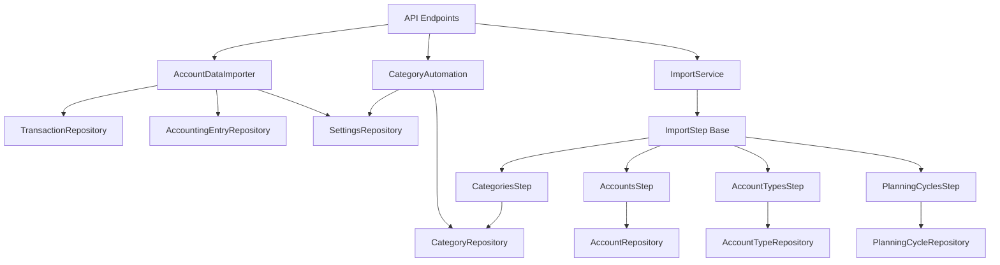

# Services Layer

Documentation of FiniA's business logic layer that orchestrates repositories and implements domain workflows.

---

## Overview

The **Services Layer** sits between API endpoints and repositories, implementing:

- ✅ **Business Logic** - Domain rules and workflows
- ✅ **Orchestration** - Coordinate multiple repositories
- ✅ **Data Transformation** - Convert between formats
- ✅ **Complex Operations** - Multi-step processes

**Architecture:**

```
API Layer (FastAPI Routers)
    ↓
Services Layer (Business Logic)
    ↓
Repository Layer (Data Access)
    ↓
Database (MySQL/MariaDB)
```

---

## Service Catalog

FiniA has **3 main service modules** and **5 import steps**:

### Main Services

1. **AccountDataImporter** - CSV import orchestration
2. **CategoryAutomation** - Rule evaluation and application
3. **ImportService** - Generic import pipeline

### Import Steps

4. **AccountsStep** - Import accounts from YAML
5. **CategoriesStep** - Import categories from YAML
6. **AccountTypesStep** - Import account types from YAML
7. **PlanningCyclesStep** - Import planning cycles from YAML
8. **Base ImportStep** - Abstract interface for steps

---

## 1. AccountDataImporter

**File:** [src/services/account_data_importer.py](../../src/services/account_data_importer.py)

**Purpose:** Orchestrate CSV transaction imports with format detection, validation, and duplicate detection.

---

### Initialization

```python
from services.account_data_importer import AccountDataImporter

importer = AccountDataImporter(
    pool_manager=connection_pool_manager,
    session_id="user_session_123"
)
```

**Parameters:**
- `pool_manager` - ConnectionPoolManager instance for database access
- `session_id` - Session ID for connection pool (user-specific)

---

### Key Methods

#### Load Import Formats

```python
# Load all import formats from tbl_setting
formats = importer._load_all_formats()
# Returns: {'csv-cb': {...}, 'csv-spk': {...}, 'csv-mintos': {...}}

# Get specific format mapping
mapping = importer._get_mapping("csv-cb")
# Returns: {
#     'delimiter': ';',
#     'encoding': 'ISO-8859-1',
#     'date_format': '%d.%m.%Y',
#     'columns': {
#         'dateValue': {'names': ['Buchungstag', 'Valuta']},
#         'amount': 'Betrag',
#         'description': 'Umsatzart',
#         ...
#     }
# }
```

**Format Storage:**
- Import formats stored in `tbl_setting` with key `import_format`
- Each entry is a JSON object: `{"name": "csv-cb", "config": {...}}`
- Cached after first load for performance

---

#### Field Extraction Strategies

The importer supports **3 extraction strategies**:

##### Strategy 1: Names (Priority Fallbacks)

```python
# Config:
'dateValue': {'names': ['Buchungstag', 'Valuta', 'Date']}

# Behavior: Try columns in order, use first non-empty
# CSV header: "Valuta", "Description", "Amount"
# Result: Uses "Valuta" column
```

##### Strategy 2: Join (Concatenate Columns)

```python
# Config:
'recipientApplicant': {
    'join': ['Empfänger', 'Verwendungszweck'],
    'separator': ' | '
}

# Behavior: Combine multiple columns with separator
# Row: {'Empfänger': 'REWE', 'Verwendungszweck': 'Groceries'}
# Result: "REWE | Groceries"
```

##### Strategy 3: Regex (Extract Patterns)

```python
# Config:
'iban': {
    'regex': r'DE\d{20}',
    'source': 'Verwendungszweck'
}

# Behavior: Extract pattern from source column
# Row: {'Verwendungszweck': 'Payment IBAN: DE12345678901234567890'}
# Result: "DE12345678901234567890"
```

---

#### CSV Header Validation

```python
# Validate CSV headers before import
csv_fieldnames = ['Buchungstag', 'Betrag', 'Beschreibung']
columns_config = mapping['columns']

is_valid = importer._validate_csv_headers(
    csv_fieldnames=csv_fieldnames,
    columns=columns_config,
    csv_filename="bank_statements.csv"
)

# Returns: True if all required columns found, False otherwise
# Prints detailed error if validation fails:
# ❌ FEHLER - Datei: bank_statements.csv
#    Erforderliche Spalten nicht gefunden:
#    - dateValue: Expected ['Buchungstag', 'Valuta']
#    - amount: Expected 'Betrag'
```

**Validation Rules:**
- **Required:** All non-null columns in format config
- **Optional:** Columns with `null` value in config
- **Strategies:** Validates based on strategy type (names/join/regex)

---

#### Import CSV File

```python
from decimal import Decimal
from datetime import datetime
from pathlib import Path

# Import transactions from CSV
result = importer.import_transactions_from_csv(
    csv_path=Path("/data/bank_statements.csv"),
    format_name="csv-cb",
    account_id=1,
    apply_automation=True
)

# Returns:
# {
#     'status': 'success',
#     'imported': 25,
#     'duplicates': 5,
#     'errors': 0,
#     'warnings': [],
#     'error_details': []
# }
```

**Process:**
1. Load format configuration from `tbl_setting`
2. Validate CSV headers against format requirements
3. Read CSV rows with correct delimiter/encoding
4. Extract fields using mapping strategies
5. Parse amounts (decimal separator) and dates (format)
6. Check for duplicates (SHA-256 hash)
7. Insert transactions into `tbl_transaction`
8. Create accounting entries in `tbl_accountingEntry`
9. Apply category automation rules (if enabled)

---

#### Duplicate Detection

```python
# Transactions are hashed to detect duplicates
# Hash based on: account_id, amount, dateValue, description, iban

# Example:
# Account: 1
# Amount: -45.50
# Date: 2025-01-15
# Description: "REWE Markt"
# IBAN: "DE12345..."

# Hash: SHA-256("1|-45.50|2025-01-15|REWE Markt|DE12345...")
# Stored in: tbl_transaction.hash

# On import:
# - Check if hash exists
# - Skip if duplicate
# - Insert if new
```

**Benefits:**
- Prevents duplicate imports
- Fast lookup (indexed hash column)
- Works across multiple imports

---

### Usage Example

```python
from services.account_data_importer import AccountDataImporter
from pathlib import Path

# Initialize importer
importer = AccountDataImporter(
    pool_manager=pool_manager,
    session_id=session_id
)

# Import CSV file
result = importer.import_transactions_from_csv(
    csv_path=Path("/uploads/commerzbank_2025_01.csv"),
    format_name="csv-cb",
    account_id=1,
    apply_automation=True
)

if result['status'] == 'success':
    print(f"✅ Imported {result['imported']} transactions")
    print(f"⏭️  Skipped {result['duplicates']} duplicates")
else:
    print(f"❌ Import failed: {result.get('message')}")
    for error in result.get('error_details', []):
        print(f"   - {error}")
```

---

## 2. CategoryAutomation

**File:** [src/services/category_automation.py](../../src/services/category_automation.py)

**Purpose:** Evaluate automation rules and apply categories to transactions.

---

### Rule Structure

```json
{
  "id": 1,
  "name": "Groceries - REWE",
  "categoryId": 5,
  "active": true,
  "priority": 1,
  "conditions": [
    {
      "id": 1,
      "type": "contains",
      "columnName": "recipientApplicant",
      "value": "REWE",
      "caseSensitive": false
    },
    {
      "id": 2,
      "type": "amountRange",
      "columnName": "amount",
      "minAmount": -500,
      "maxAmount": 0
    }
  ],
  "conditionLogic": "1 AND 2",
  "accounts": [1, 2]
}
```

**Fields:**
- `id` - Unique rule ID
- `name` - Rule description
- `categoryId` - Target category
- `active` - Enable/disable rule
- `priority` - Evaluation order (lower = higher priority)
- `conditions` - List of condition objects
- `conditionLogic` - Expression combining conditions (AND/OR/UND/ODER)
- `accounts` - Limit to specific accounts (empty = all accounts)

---

### Condition Types

#### String-based Conditions

```python
# Type: contains
# Matches if pattern is substring of field
evaluate_condition(
    transaction_data={'recipientApplicant': 'REWE Markt GmbH'},
    condition={'type': 'contains', 'columnName': 'recipientApplicant', 'value': 'REWE'}
)
# Returns: True

# Type: equals
# Exact match (case-sensitive or insensitive)
evaluate_condition(
    transaction_data={'description': 'Salary'},
    condition={'type': 'equals', 'columnName': 'description', 'value': 'salary', 'caseSensitive': False}
)
# Returns: True

# Type: startsWith
# Matches if field starts with pattern
evaluate_condition(
    transaction_data={'iban': 'DE1234567890'},
    condition={'type': 'startsWith', 'columnName': 'iban', 'value': 'DE'}
)
# Returns: True

# Type: endsWith
# Matches if field ends with pattern
evaluate_condition(
    transaction_data={'recipientApplicant': 'Amazon.de'},
    condition={'type': 'endsWith', 'columnName': 'recipientApplicant', 'value': '.de'}
)
# Returns: True

# Type: regex
# Regex pattern matching
evaluate_condition(
    transaction_data={'description': 'Card payment 12345'},
    condition={'type': 'regex', 'columnName': 'description', 'value': r'Card payment \d+', 'caseSensitive': False}
)
# Returns: True
```

---

#### Amount-based Conditions

```python
# Type: amountRange
# Matches if amount is within range
evaluate_condition(
    transaction_data={'amount': -45.50},
    condition={
        'type': 'amountRange',
        'columnName': 'amount',
        'minAmount': -100,
        'maxAmount': 0
    }
)
# Returns: True (within range)

# Boundary conditions:
# minAmount=None: No lower limit
# maxAmount=None: No upper limit
```

---

### Condition Logic

```python
from services.category_automation import parse_condition_logic

# Simple OR
result = parse_condition_logic(
    logic_str="1 OR 2",
    condition_results={1: True, 2: False}
)
# Returns: True

# Simple AND
result = parse_condition_logic(
    logic_str="1 AND 2",
    condition_results={1: True, 2: False}
)
# Returns: False

# Complex expression with parentheses
result = parse_condition_logic(
    logic_str="(1 OR 2) AND 3",
    condition_results={1: False, 2: True, 3: True}
)
# Returns: True

# German operators (UND, ODER)
result = parse_condition_logic(
    logic_str="1 UND 2",
    condition_results={1: True, 2: True}
)
# Returns: True

# Fallback on error: OR all conditions
result = parse_condition_logic(
    logic_str="invalid syntax",
    condition_results={1: True, 2: False}
)
# Returns: True (fallback to OR)
```

**Supported Operators:**
- **English:** AND, OR, NOT
- **German:** UND, ODER, NICHT
- **Grouping:** Parentheses `()`

---

### Rule Evaluation

```python
from services.category_automation import evaluate_rule

transaction = {
    'description': 'Lastschrift',
    'recipientApplicant': 'REWE Markt',
    'amount': -45.50,
    'iban': 'DE12345...',
    'account_id': 1
}

rule = {
    'id': 1,
    'categoryId': 5,
    'active': True,
    'priority': 1,
    'conditions': [
        {'id': 1, 'type': 'contains', 'columnName': 'recipientApplicant', 'value': 'REWE'},
        {'id': 2, 'type': 'amountRange', 'columnName': 'amount', 'minAmount': -100, 'maxAmount': 0}
    ],
    'conditionLogic': '1 AND 2',
    'accounts': [1, 2]
}

matches = evaluate_rule(transaction, rule)
# Returns: True (both conditions match, account is in list)
```

**Evaluation Steps:**
1. Check if rule is active
2. Check if transaction account is in rule's account list (empty = all accounts)
3. Evaluate each condition against transaction data
4. Parse condition logic expression
5. Return True if logic evaluates to True

---

### Apply Automation

```python
from services.category_automation import apply_automation_rules

# Load rules from tbl_setting (key: 'category_automation')
rules = load_rules_from_settings(session_id)

# Sort by priority (lower = higher priority)
rules.sort(key=lambda r: r.get('priority', 999))

# Apply rules to transactions
for transaction in transactions:
    for rule in rules:
        if evaluate_rule(transaction, rule):
            # Apply category
            category_id = rule['categoryId']
            update_transaction_category(transaction['id'], category_id)
            break  # Stop at first match (priority order)
```

---

### Usage Example

```python
from services.category_automation import evaluate_rule, apply_automation_rules
from repositories.settings_repository import SettingsRepository

# Load automation rules
with UnitOfWork(connection) as uow:
    settings_repo = SettingsRepository(uow)
    rule_entries = settings_repo.get_setting_entries(key='category_automation')
    
    rules = []
    for entry in rule_entries:
        rule_data = json.loads(entry['value'])
        rules.append(rule_data)

# Sort by priority
rules.sort(key=lambda r: r.get('priority', 999))

# Test rule against transaction
transaction = {
    'description': 'Grocery shopping',
    'recipientApplicant': 'REWE Markt',
    'amount': -45.50,
    'iban': 'DE12345...',
    'account_id': 1
}

for rule in rules:
    if evaluate_rule(transaction, rule):
        print(f"✅ Rule '{rule['name']}' matches!")
        print(f"   Category: {rule['categoryId']}")
        break
```

---

## 3. ImportService

**File:** [src/services/import_service.py](../../src/services/import_service.py)

**Purpose:** Generic import pipeline for YAML data imports (accounts, categories, planning cycles).

---

### Architecture

```python
from services.import_service import ImportService
from services.import_steps.base import ImportStep

# Define import steps
steps = [
    AccountTypesStep(),
    AccountsStep(),
    CategoriesStep(),
    PlanningCyclesStep()
]

# Create import service
import_service = ImportService(
    pool_manager=pool_manager,
    session_id=session_id,
    steps=steps
)

# Run import
data = load_yaml_file('cfg/data.yaml')
success = import_service.run(data)
```

**Features:**
- **Sequential execution** - Steps run in order
- **Transaction per step** - Each step has its own UnitOfWork
- **Error handling** - Continue on error, return overall success status

---

### Import Steps

#### Base ImportStep Interface

**File:** [src/services/import_steps/base.py](../../src/services/import_steps/base.py)

```python
from abc import ABC, abstractmethod

class ImportStep(ABC):
    @abstractmethod
    def name(self) -> str:
        """Return step name for logging"""
        ...

    @abstractmethod
    def run(self, data: dict, uow) -> bool:
        """
        Execute import step.
        
        Args:
            data: YAML data dictionary
            uow: UnitOfWork for database access
            
        Returns:
            True if successful, False otherwise
        """
        ...
```

---

#### CategoriesStep

**File:** [src/services/import_steps/categories.py](../../src/services/import_steps/categories.py)

```python
from services.import_steps.base import ImportStep
from repositories.category_repository import CategoryRepository

class CategoriesStep(ImportStep):
    def name(self) -> str:
        return "categories"
    
    def run(self, data: dict, uow) -> bool:
        if 'categories' not in data:
            return True
        
        repo = CategoryRepository(uow)
        
        # Start ID counter from max existing ID + 1
        max_id = repo.get_max_category_id()
        category_id_counter = [max_id + 1]
        
        def insert_category_recursive(category_data, parent_id=None):
            category_name = category_data.get('name')
            
            # Check if category exists
            existing_id = repo.get_category_id_by_name_and_parent(category_name, parent_id)
            
            if existing_id:
                current_id = existing_id
            else:
                # New category
                current_id = category_id_counter[0]
                repo.insert_category(current_id, category_name, parent_id)
                category_id_counter[0] += 1
            
            # Process subcategories
            for subcategory in category_data.get('subcategories', []):
                insert_category_recursive(subcategory, current_id)
            
            return current_id
        
        # Import all categories
        for category in data['categories']:
            insert_category_recursive(category)
        
        return True
```

**YAML Format:**

```yaml
categories:
  - name: Living Expenses
    subcategories:
      - name: Groceries
      - name: Rent
      - name: Utilities
        subcategories:
          - name: Electricity
          - name: Water
```

---

#### AccountsStep

**File:** [src/services/import_steps/accounts.py](../../src/services/import_steps/accounts.py)

```python
from services.import_steps.base import ImportStep
from repositories.account_repository import AccountRepository
from domain.account import Account

class AccountsStep(ImportStep):
    def name(self) -> str:
        return "accounts"
    
    def run(self, data: dict, uow) -> bool:
        if 'accounts' not in data:
            return True
        
        repo = AccountRepository(uow)
        
        for account_data in data['accounts']:
            account = Account(
                name=account_data['name'],
                iban_accountNumber=account_data.get('iban'),
                bic_market=account_data.get('bic'),
                startAmount=account_data.get('startAmount', 0),
                dateStart=account_data.get('dateStart'),
                dateEnd=account_data.get('dateEnd'),
                type_name=account_data.get('type')
            )
            repo.insert(account)
        
        # Update clearing accounts
        for account_data in data['accounts']:
            clearing_name = account_data.get('clearingAccount')
            if clearing_name:
                repo.update_clearing_account(
                    name=account_data['name'],
                    clearing_name=clearing_name
                )
        
        return True
```

**YAML Format:**

```yaml
accounts:
  - name: Personal Checking
    iban: DE123...
    bic: ABCDEFGH
    type: Girokonto
    startAmount: 1000.00
    dateStart: 2025-01-01
    clearingAccount: Clearing Account
```

---

#### AccountTypesStep

**File:** [src/services/import_steps/account_types.py](../../src/services/import_steps/account_types.py)

```python
from services.import_steps.base import ImportStep
from repositories.account_type_repository import AccountTypeRepository

class AccountTypesStep(ImportStep):
    def name(self) -> str:
        return "account_types"
    
    def run(self, data: dict, uow) -> bool:
        if 'accountTypes' not in data:
            return True
        
        repo = AccountTypeRepository(uow)
        
        for type_data in data['accountTypes']:
            repo.insert_type(
                type_id=type_data['id'],
                type_name=type_data['name']
            )
        
        return True
```

**YAML Format:**

```yaml
accountTypes:
  - id: 1
    name: Girokonto
  - id: 2
    name: Wertpapier-Depot
```

---

#### PlanningCyclesStep

**File:** [src/services/import_steps/planning_cycles.py](../../src/services/import_steps/planning_cycles.py)

```python
from services.import_steps.base import ImportStep
from repositories.planning_cycle_repository import PlanningCycleRepository

class PlanningCyclesStep(ImportStep):
    def name(self) -> str:
        return "planning_cycles"
    
    def run(self, data: dict, uow) -> bool:
        if 'planningCycles' not in data:
            return True
        
        repo = PlanningCycleRepository(uow)
        
        for cycle_data in data['planningCycles']:
            repo.insert_cycle(
                cycle_id=cycle_data['id'],
                cycle_name=cycle_data['cycle'],
                period_value=cycle_data.get('periodValue'),
                period_unit=cycle_data.get('periodUnit')
            )
        
        return True
```

**YAML Format:**

```yaml
planningCycles:
  - id: 1
    cycle: Monthly
    periodValue: 1
    periodUnit: m
  - id: 2
    cycle: Yearly
    periodValue: 1
    periodUnit: y
```

---

### Usage Example

```python
from services.import_service import ImportService
from services.import_steps.accounts import AccountsStep
from services.import_steps.categories import CategoriesStep
from services.import_steps.account_types import AccountTypesStep
from services.import_steps.planning_cycles import PlanningCyclesStep
import yaml

# Load YAML data
with open('cfg/data.yaml', 'r', encoding='utf-8') as f:
    data = yaml.safe_load(f)

# Define import steps
steps = [
    AccountTypesStep(),
    AccountsStep(),
    CategoriesStep(),
    PlanningCyclesStep()
]

# Create import service
import_service = ImportService(
    pool_manager=pool_manager,
    session_id=session_id,
    steps=steps
)

# Run import
success = import_service.run(data)

if success:
    print("✅ Import completed successfully")
else:
    print("❌ Import completed with errors")
```

---

## Service Dependencies



---

## Best Practices

### ✅ DO

**1. Use Services for Business Logic**

```python
# Good: Business logic in service
class TransactionService:
    def import_and_categorize(self, csv_path, account_id):
        # Import transactions
        importer = AccountDataImporter(...)
        result = importer.import_transactions_from_csv(...)
        
        # Apply automation
        automation = CategoryAutomation(...)
        automation.apply_rules(result['transaction_ids'])
        
        return result

# Bad: Business logic in repository
class TransactionRepository:
    def insert_and_categorize(self, ...):
        # Mixing data access with business logic
        self.insert(...)
        self._apply_automation(...)  # Wrong layer!
```

**2. Handle Errors Gracefully**

```python
# Good: Detailed error reporting
try:
    result = importer.import_transactions_from_csv(...)
    return {
        'status': 'success',
        'imported': result['imported'],
        'warnings': result.get('warnings', [])
    }
except ValueError as e:
    return {
        'status': 'error',
        'message': str(e),
        'error_details': [...]
    }
```

**3. Use Connection Pool Manager**

```python
# Good: Use connection pool
importer = AccountDataImporter(
    pool_manager=pool_manager,
    session_id=session_id
)

# Bad: Create new connections
connection = mysql.connector.connect(...)  # Resource leak!
```

---

### ❌ DON'T

**1. Perform Database Operations Directly**

```python
# Bad: Direct SQL in service
class TransactionService:
    def get_transactions(self):
        cursor.execute("SELECT * FROM tbl_transaction")
        # Use repository instead!

# Good: Use repository
class TransactionService:
    def get_transactions(self):
        repo = TransactionRepository(cursor)
        return repo.get_all_transactions()
```

**2. Mix Validation with Business Logic**

```python
# Bad: Mixed concerns
def import_csv(csv_path, format_name):
    # Validation mixed with import
    if not csv_path.exists():
        raise ValueError("File not found")
    # Import logic
    ...

# Good: Separate validation
def validate_import_request(csv_path):
    if not csv_path.exists():
        raise ValueError("File not found")

def import_csv(csv_path, format_name):
    validate_import_request(csv_path)
    # Import logic
    ...
```

---

## Testing Services

### Unit Testing

```python
import unittest
from unittest.mock import MagicMock
from services.category_automation import evaluate_rule

class TestCategoryAutomation(unittest.TestCase):
    def test_evaluate_rule_contains(self):
        transaction = {
            'recipientApplicant': 'REWE Markt',
            'amount': -45.50
        }
        
        rule = {
            'active': True,
            'conditions': [
                {'id': 1, 'type': 'contains', 'columnName': 'recipientApplicant', 'value': 'REWE'}
            ],
            'conditionLogic': '1',
            'accounts': []
        }
        
        result = evaluate_rule(transaction, rule)
        self.assertTrue(result)
```

---

### Integration Testing

```python
import unittest
from services.account_data_importer import AccountDataImporter
from pathlib import Path

class TestAccountDataImporterIntegration(unittest.TestCase):
    def setUp(self):
        self.pool_manager = get_test_connection_pool()
        self.session_id = "test_session"
        self.importer = AccountDataImporter(self.pool_manager, self.session_id)
    
    def test_import_csv(self):
        result = self.importer.import_transactions_from_csv(
            csv_path=Path("test/data/sample.csv"),
            format_name="csv-test",
            account_id=1,
            apply_automation=False
        )
        
        self.assertEqual(result['status'], 'success')
        self.assertGreater(result['imported'], 0)
```

---

## Related Documentation

- [Repository Pattern](./repositories.md) - Data access layer
- [CSV Import System](../import/csv_import.md) - Import architecture
- [Category Automation](../features/category_automation.md) - Automation guide
- [API Documentation](../api.md) - REST endpoints

---

## Summary

FiniA's services layer provides:

✅ **Clear Separation** - Business logic isolated from data access  
✅ **Orchestration** - Coordinate multiple repositories  
✅ **Reusability** - Services shared across API endpoints  
✅ **Testability** - Easy to unit test with mocks  
✅ **Maintainability** - Changes localized to one layer  

**3 Main Services** + **5 Import Steps** covering all domain workflows.
